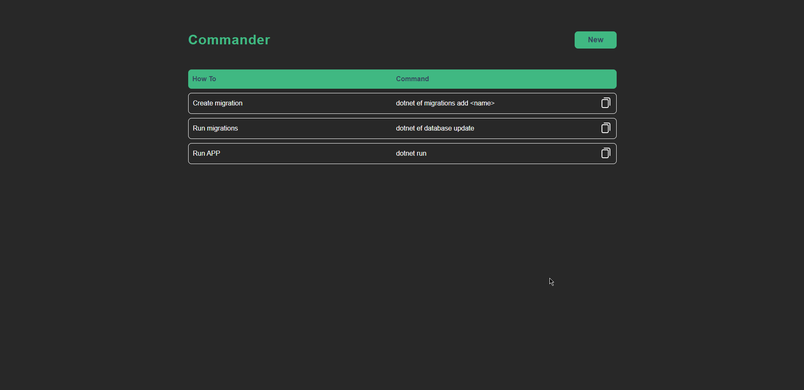

<h1 align="center">Commander</h1>

<h4 align="center">
    This application is to save commands and list after for remember
</h4>

---

<p align="center">
  

  

  

  
</p>

<h2>📔 Description</h2>

## This is my first application with this stack (.NET and VueJS). Is a simple repository to save commands and list after for remember. It's possible copy and paste clicking in button, very easy

`Application`

<details>
  <summary>See</summary>



</details>

---

<h2>🗺 API Routes</h2>

| Method | Path               | Description                    |
| ------ | ------------------ | ------------------------------ |
| GET    | /api/commands      | Get all commands               |
| GET    | /api/commands/{id} | Get one command                |
| POST   | /api/commands      | Create a new command           |
| PUT    | /api/commands/{id} | Update a command               |
| PATCH  | /api/commands/{id} | Update only field in a command |
| DELETE | /api/commands/{id} | Delete a command               |

---

<h2>🚀 Technologies</h2>

- [Typescript](https://www.typescriptlang.org/)
- [VueJS](https://vuejs.org/)
- [VueX](https://vuex.vuejs.org/)
- [Vue Routes](https://router.vuejs.org/)
- [Axios](https://github.com/axios/axios)
- [ESLint](https://eslint.org/)
- [Prettier](https://prettier.io/)
- [Postgres](https://www.postgresql.org/)
- [Docker](https://www.docker.com/)
- [.NET Core](https://dotnet.microsoft.com/)
- [Entity Framework](https://docs.microsoft.com/pt-br/ef/)

---

<h2>❓ How to use</h2>

You need a postgres intence running on 5432 port

`Backend`

```bash
# Clone this repository
$ git clone https://github.com/MarceloHBoff/commander/tree/master/backend

# Go into the repository
$ cd commander/backend

# Install dependencies for the backend
$ dotnet restore

# Run the backend server
$ dotnet run
```

`Frontend`

```bash
# Clone this repository
$ git clone https://github.com/MarceloHBoff/commander/tree/master/frontend

# Go into the repository
$ cd commander/frontend

# Install dependencies for the frontend
$ yarn

# Run the frontend
$ yarn serve
```

Made with love by [Marcelo Boff!](https://www.linkedin.com/in/marcelo-boff)
